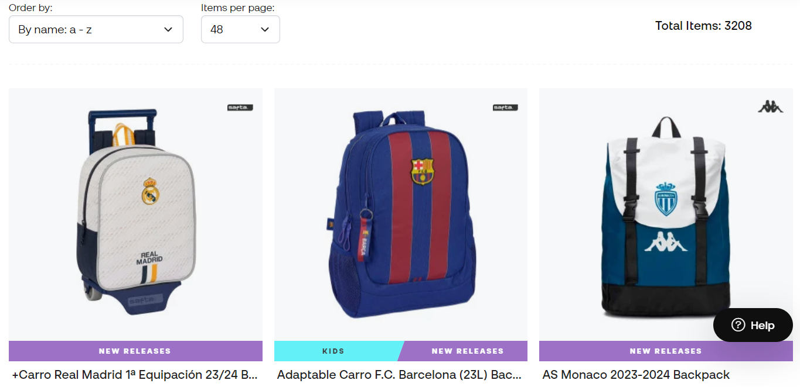
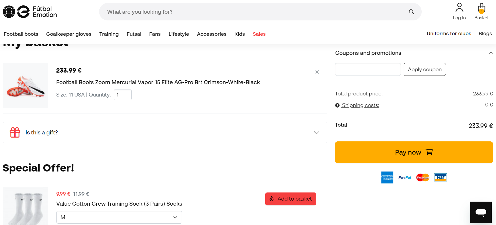

# Lab 4
## Test-cases (интернет-магазин [futbolemotion.com](https://www.futbolemotion.com/en))

<strong>1</strong>. Сортировка товара. 
<strong>Краткое описание:</strong> Проверка корректности сортировки товаров 
<strong>Предусловие (входные данные):</strong> страница с товарами. 
<strong>Шаги:</strong> 
1. Зайти на сайт futbolemotion.com
2. Выбрать необходимую категорию товаров
3. В меню “Order by” выбрать необходимую сортировку
 

<strong>Ожидаемый результат:</strong> Товары выбранной категории сортированы по выбранному критерию 
 
<strong>Фактические результаты: </strong> как ожидали 
<strong>Статус: </strong> пройден успешно 

<strong>2.</strong> Проверка корректности добавления товара в корзину 
<strong>Краткое описание:</strong> проверка корректности добавления товара в корзину 
<strong>Предусловие (входные данные):</strong> Для выполнения этого теста мы предварительно зайдём на страницу с интересующими товарами.
<strong>Шаги:</strong> 
1. Перейти на страницу с товаром
2. Нажать на кнопку “Add to basket”

<strong>Ожидаемый результат:</strong> Товар добавлен в корзину 
<strong>Фактические результаты: </strong> На странице корзины появился добавленный товар, а также возле иконки корзины появилось количество добавленных товаров. 
 
 
<strong>Статус: </strong> тест пройден успешно 

