# Lab 4
## Test-cases (интернет-магазин [futbolemotion.com](https://www.futbolemotion.com/en))

<strong>1</strong>. Сортировка товара. 
<strong>Краткое описание:</strong> Проверка корректности сортировки товаров 
<strong>Предусловие (входные данные):</strong> страница с товарами. 
<strong>Шаги:</strong> 
1. Зайти на сайт futbolemotion.com
2. Выбрать необходимую категорию товаров
3. В меню “Order by” выбрать необходимую сортировку
 

<strong>Ожидаемый результат:</strong> Товары выбранной категории сортированы по выбранному критерию 
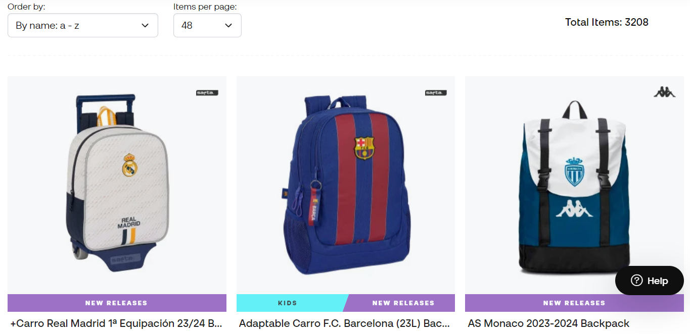 
<strong>Фактические результаты: </strong> как ожидали 
<strong>Статус: </strong> пройден успешно 

<strong>2.</strong> Проверка корректности добавления товара в корзину 
<strong>Краткое описание:</strong> проверка корректности добавления товара в корзину 
<strong>Предусловие (входные данные):</strong> Для выполнения этого теста мы предварительно зайдём на страницу с интересующими товарами.
<strong>Шаги:</strong> 
1. Перейти на страницу с товаром
2. Нажать на кнопку “Add to basket”

<strong>Ожидаемый результат:</strong> Товар добавлен в корзину 
<strong>Фактические результаты: </strong> На странице корзины появился добавленный товар, а также возле иконки корзины появилось количество добавленных товаров. 
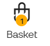 
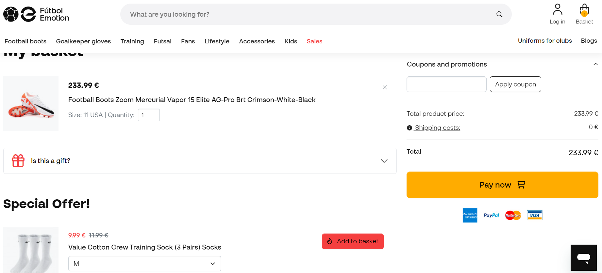 
<strong>Статус: </strong> тест пройден успешно 

<strong>3.</strong>. Регистрация. 
<strong>Краткое описание:</strong> проверка корректности регистрации на сайте 
<strong>Предусловие (входные данные):</strong> Для выполнения этого теста мы предварительно зайдём в панель регистрации нового пользователя 
<strong>Шаги:</strong> 
1. Зайти на сайт [futbolemotion.com]
2. Выбрать на панели меню пункт "Log in" и выбрать пункт "register"
3. Ввести данные.
4. Поставить галочку рядом с согласием.
5. Нажать кнопку Register.

<strong>Ожидаемый результат:</strong> Пройдена регистрация 
<strong>Фактические результаты:</strong> Соответствует ожидаемому результату 
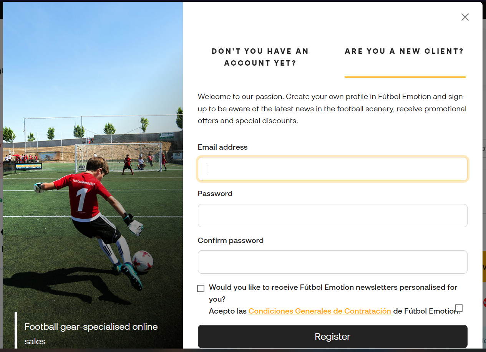 
<strong>Статус: </strong> Тест пройден успешно 

<strong>4.</strong>. Добавления фотографии в профиль. 
<strong>Краткое описание:</strong> Проверка корректности добавления аватарки для профиля
в личном кабинете 
<strong>Предусловие (входные данные):</strong> Мы авторизованы в системе
(т.е. выполнен вход в личный кабинет) 
<strong>Шаги:</strong> 
1. Зайти на сайт [futbolemotion.com](https://www.futbolemotion.com/en)
2. Нажать в верхнем меню кнопку "Account"
3. Появится новое окно с информацией про аккаунт, нажать там на закругленную фотографию со
смайликом головы человека
4. После нажатия открывается проводник. Выбираем необходимую фотографию 
5. Выбрали по "ошибке" файл с расширением .pdf. Фотография не применилась, но происходит постоянная
загрузка и информации про ошибку не вывелось. В следующий раз выбираем
уже необходимый формат
6. Проверяем, что фотография применилась

<strong>Ожидаемый результат:</strong> Фотография применилась, происходит обработка ошибок
при добавлении файла в неверном формате 
<strong>Фактические результаты:</strong> Фотография добавилась, обработка ошибок не предусмотрена 
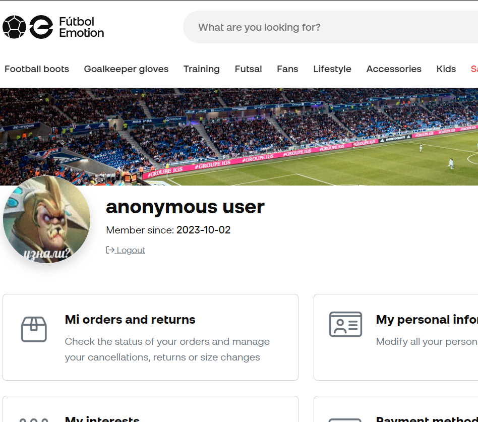 
<strong>Статус: </strong> Тест пройден частично 

<strong>5.</strong>. Изменение валюты. 
<strong>Краткое описание:</strong> Проверка изменения валюты, в которой
указывается стоимость товаров 
<strong>Предусловие (входные данные):</strong> нету 
<strong>Шаги:</strong> 
1. Зайти на сайт [futbolemotion.com](https://www.futbolemotion.com/en)
2. Выбрать на панели меню пункт с названием текущей валюты
3. У нас появляется окно с возможностью выбора
валюты, необходимо выбрать из выпадающего списка
   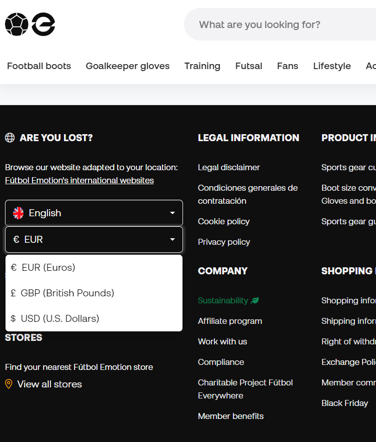 
4. Проверяем, чтобы валюта на панели изменился

<strong>Ожидаемый результат:</strong> Измененная валюта отображается 
<strong>Фактические результаты:</strong> Соответствует ожидаемому результату 
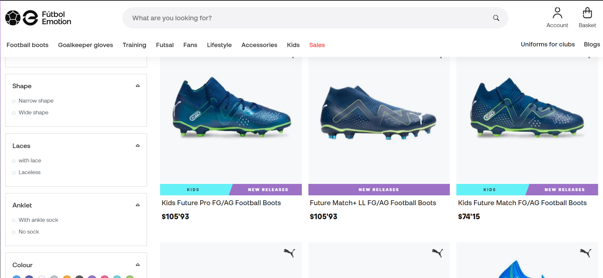 
<strong>Статус: </strong> Тест пройден успешно 

<strong>6.</strong>. Выполнение поиска товара. 
<strong>Краткое описание:</strong> Необходимо найти товар, который мы ищем
по запросу в поисковой панели. Проверить, чтобы он соответствовал нашему запросу 
<strong>Предусловие (входные данные):</strong> нету 
<strong>Шаги:</strong> 
1. Зайти на сайт [futbolemotion.com](https://www.futbolemotion.com/en)
2. Ввести в специальной панели поиска отрегулировать наши параметры поиска.
3. Нажать кнопку "Search" с иконкой лупы 
   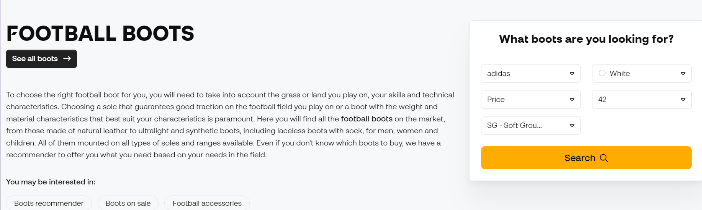 
4. Выводится список товаров по нашему запросу

<strong>Ожидаемый результат:</strong> Появляется список товаров, соответствующий 
нашему запросу 
<strong>Фактические результаты:</strong> Соответствует ожидаемому результату 
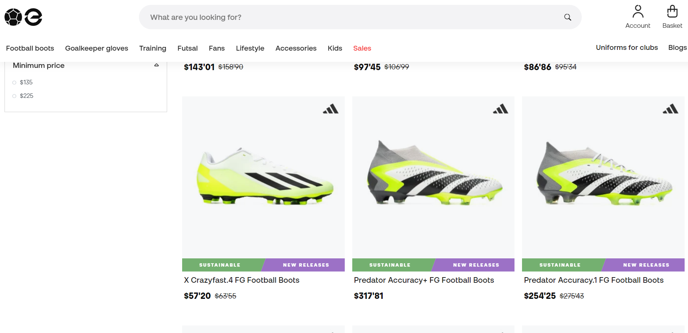 
<strong>Статус: </strong> Тест пройден успешно 

<strong>7.</strong> Просмотр инцормации о местонахождениях магазинов. 
<strong>Краткое описание:</strong> проверка корректности просмотра информации о магазинах 
<strong>Предусловие (входные данные):</strong> нету 
<strong>Шаги:</strong> 
1. Зайти на сайт [futbolemotion.com](https://www.futbolemotion.com/en)
2. Перейти STORES

Find your nearest Fútbol Emotion store

 [View all stores](https://www.futbolemotion.com/en/stores) 

<strong>Ожидаемый результат:</strong> открытие страницы с местонахождением магазинов 
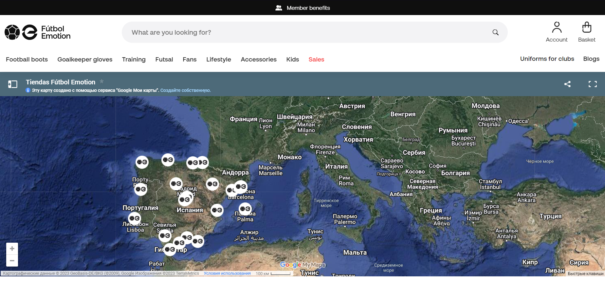 
<strong>Фактические результаты: </strong> как ожидали 
<strong>Статус: </strong> пройден успешно 

<strong>8.</strong>. Использование купона 
<strong>Краткое описание:</strong> проверка работы купона 
<strong>Предусловие (входные данные):</strong> Купон: SPIDERFE 
<strong>Шаги:</strong> 
1. Зайти на сайт [futbolemotion.com](https://www.futbolemotion.com/en)
2. Перейти в корзину.
3. В поле "Coupons and promotions" ввести необходимый купон
4. При корректном купоне появляеться соответсвующая надпись 
   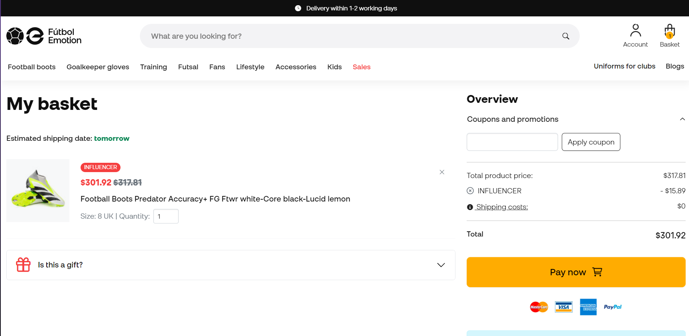 
5. При не корректном купоне появляеться соответсвующая надпись 
   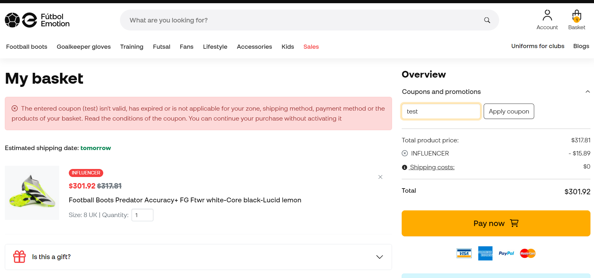 

<strong>Ожидаемый результат:</strong> Купон использован 
<strong>Фактические результаты: </strong> как ожидали 
<strong>Статус: </strong> пройден успешно 

<strong>9.</strong>. Выбор любимой команды. 
<strong>Краткое описание:</strong> проверка корректности
выполнения выбора любимой команды 
<strong>Предусловие (входные данные):</strong> нету 
<strong>Шаги:</strong> 
1. Зайти на сайт [futbolemotion.com](https://www.futbolemotion.com/en)
2. Зайти в панель Account->My interests.
3. В поле "Yout favourite teams".
4. Выбрать нужные команды 
   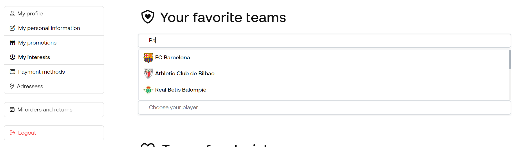 

<strong>Ожидаемый результат:</strong> присутствуют выбранные команды 
<strong>Фактические результаты: </strong> появились требуемые команды 
<strong>Статус: </strong> пройден успешно 
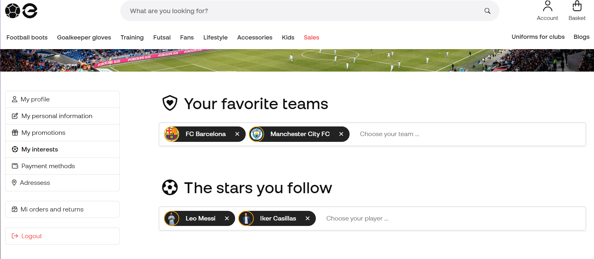 

<strong>10.</strong>. Sales 
<strong>Краткое описание:</strong> проверка скидок и акций 
<strong>Предусловие (входные данные):</strong> нету 
<strong>Шаги:</strong> 
1. Зайти на сайт [futbolemotion.com](https://www.futbolemotion.com/en)
2. В навигационном меню выбираем "Sales"
3. Переходим на страницу и видим список актуальных распродаж
   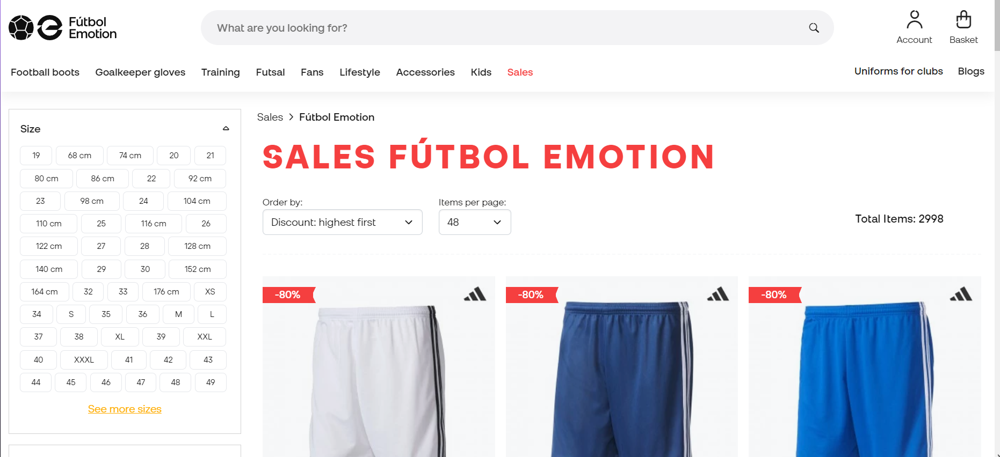 

<strong>Ожидаемый результат:</strong> Появился список товаров, на которые действуют скидки
и/или акции 
<strong>Фактические результаты: </strong> Соответсвует ожидаемому результату 
<strong>Статус: </strong> пройден успешно 

