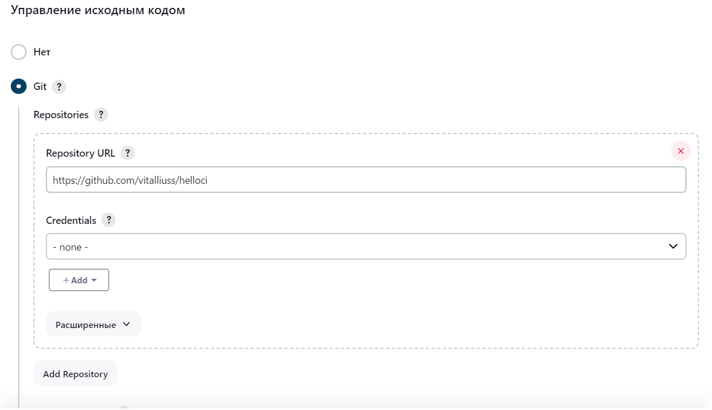
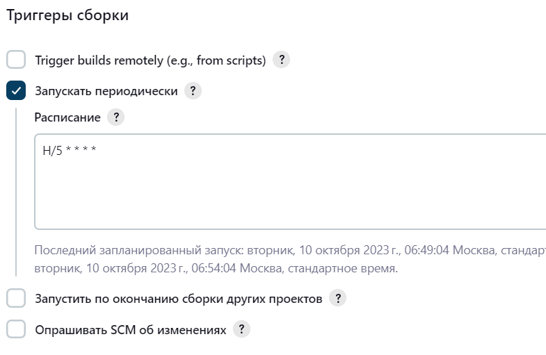
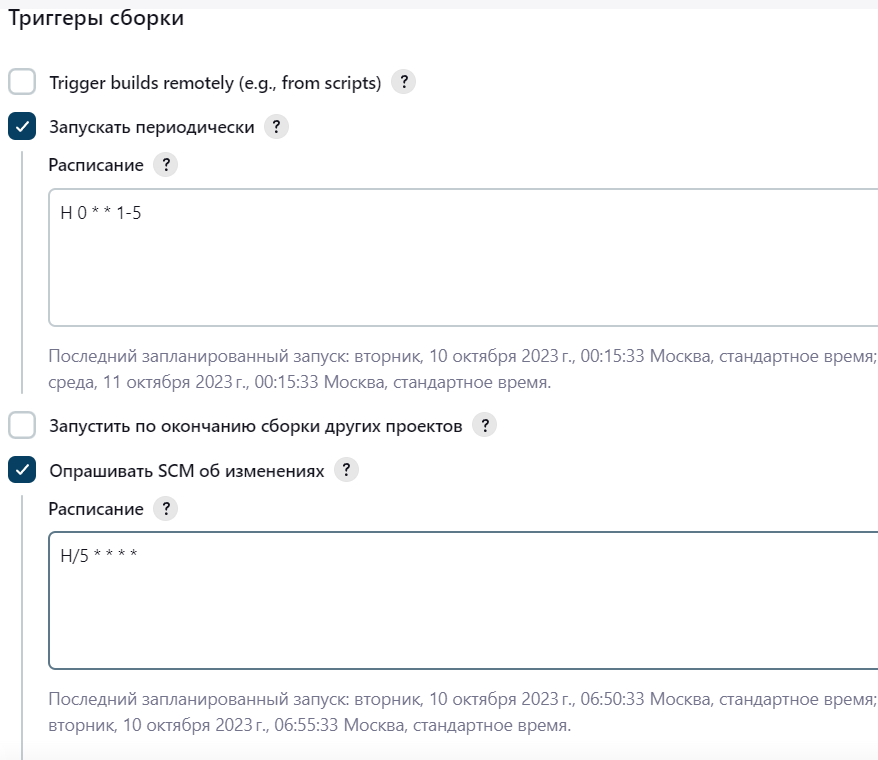
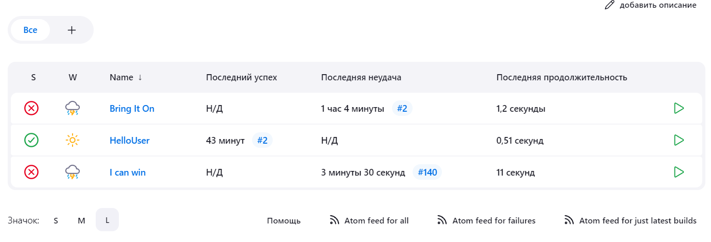
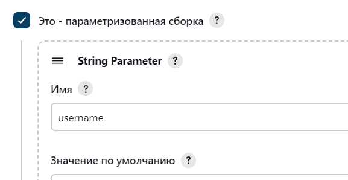
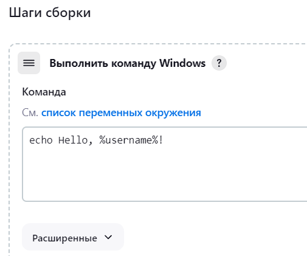
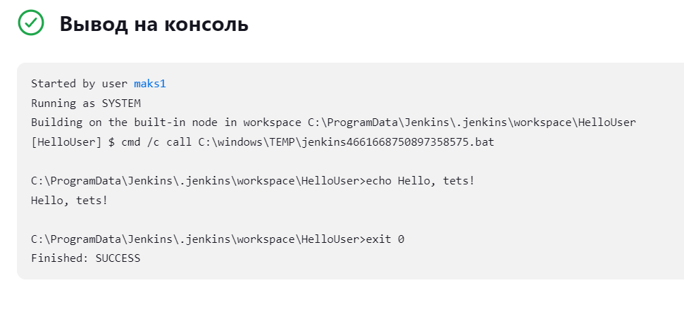
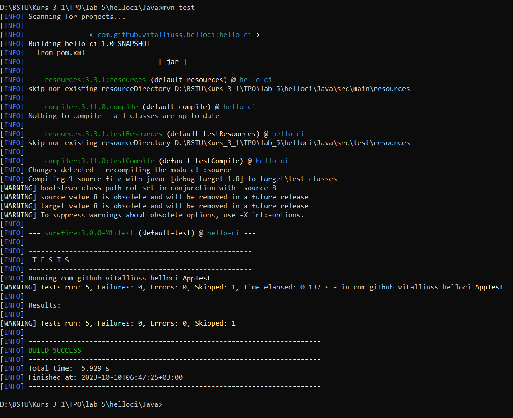

# Lab 5

<strong>Jenkins</strong> 

 

Выполение задачи раз в 5 минут
 
 

Запуск тестов не позднее чем через 5 минут после коммита в git
Каждый будний день в полночь
  
 

Опубликуйте файл “Java\target\surefire-reports\com.github.vitalliuss.helloci.AppTest.txt” как артефакт
  
 
 

параметр
  
 

Выполение
  
 

Вывод
  
 

<strong>Maven</strong> 
 